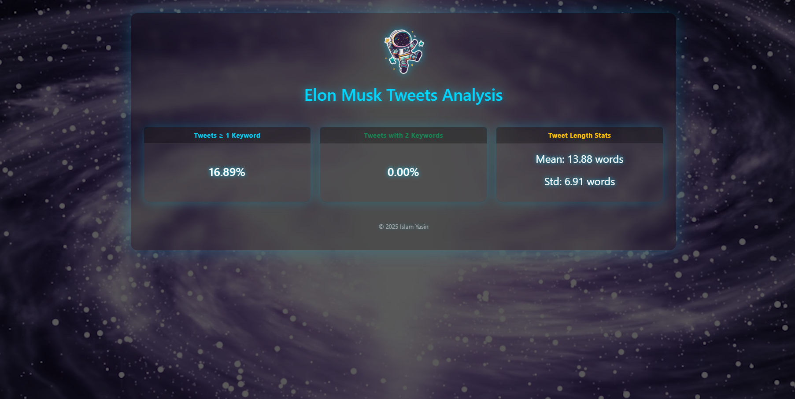

<!-- PROJECT LOGO -->
<p align="center">
  
</p>

<h1 align="center">🚀 Elon Musk Tweets Analysis using Apache Spark & Scala</h1>

<p align="center">
  <b>Analyze Elon Musk's tweets using Apache Spark (RDD API) and visualize insights with a stunning HTML dashboard.</b>
  <br>
  <br>
  <a href="https://github.com/islamyasin07/ElonMusksTweets-"><strong>Explore the repo »</strong></a>
  <br>
  <br>
  <a href="#features">Features</a> ·
  <a href="#project-structure">Structure</a> ·
  <a href="#screenshots">Screenshots</a> ·
  <a href="#how-to-run">Run Guide</a> ·
  <a href="#technologies">Stack</a>
</p>

---

## ✨ Overview

This project performs **data analytics on Elon Musk’s tweets** using **Apache Spark with Scala**.  
It provides both **statistical insights** and a **beautiful interactive dashboard** built with HTML + Bootstrap + Glassmorphism effects.

The dashboard includes:
- Keyword frequency distribution
- Tweet length statistics (Mean, Std)
- Per-keyword insights
- A dynamic video/space-themed background 🌌

---

## 🎯 Features

| Type | Description |
|------|--------------|
| 🧠 **Dynamic Input** | User enters keywords interactively via console |
| 💬 **Text Analytics** | Calculates tweet percentages by keyword occurrence |
| 📏 **Statistical Metrics** | Mean & Standard Deviation for all and per keyword |
| 🌐 **HTML Dashboard** | Interactive Bootstrap-based dashboard with video background |
| 🎁 **Bonus Analytics** | Optional export of results to HDFS for distributed environments |

---
## 🧩 Project Structure
```
elon-tweets/
├── build.sbt
├── project/
│   └── build.properties
├── src/
│   └── main/
│       ├── scala/
│       │   ├── ElonTweetsApp.scala        # Main Spark Application
│       │   ├── DataLoader.scala           # Reads CSV (local/HDFS)
│       │   ├── KeywordAnalyzer.scala      # RDD-based analytics logic
│       │   └── ReportGenerator.scala      # HTML report generator
│       └── resources/
│           ├── log4j.properties           # Logging config
│           └── application-example.properties
├── data/                                  # Local input data (ignored in .gitignore)
├── output/                                # Generated HTML reports
├── README.md
└── .gitignore

```
---

## 🖥️ Screenshots <a id="screenshots"></a>

> 

<p align="center">
  
  <br>
  <em>📊 Keyword-based statistics and insights</em>
</p>

---

## ⚙️ How to Run <a id="how-to-run"></a>

### 1️⃣ Build
```bash
sbt clean compile

